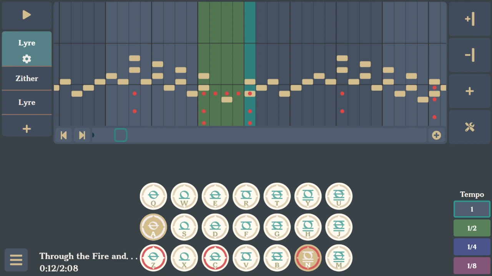

# ⚠️ APP IS BEING REWRITTEN IN NEXT.JS ⚠️

# Welcome to Genshin music and Sky music nightly

This repository holds the code of the two music apps for Genshin and Sky Cotl, you can see the published apps at [specy.app](https://specy.app)

# How to run in dev mode
You need node.js and yarn installed, if you don't have yarn, install it with `npm i yarn --global`.
Then clone the repo to a folder and install the dependencies with `yarn`, once installed, run the development server with `yarn start`

There are 4 more scripts which might be useful, run as a specific app and build as a specific app.

You can run `yarn start:sky` or `yarn start:genshin`, this will run the webapps for the specific game and swap the assets. 

# How to run desktop app in dev mode
You need to first start the development server, look [here](#how-to-run-in-dev-mode) for how to do that.
Then you can run `yarn start-tauri`
# How to build

You can use the scripts `yarn build:genshin` and `yarn build:sky` which will build the correct app, or `yarn build:all` to build both

# How to build desktop app

The app uses tauri for the desktop bundle which is a sandboxed webview. You can build it by using `yarn build-tauri:genshin`, `yarn build-tauri:sky`, `yarn build-tauri:all`. The config is premade to allow for updates, if you dont have a signing key, the build will fail. If you want to build without updates, go to `src-tauri/tauri.conf.json` and set `updater` to false

# Documentation
You can find the documentation of the app [here](https://github.com/Specy/genshin-music/wiki)
It is not very detailed but might help to understand how the format works.

# How to contribute
Make a new issue saying what you want to work on and wait for me to assign the issue. This way we can also communicate whether or it would be a valid issue to fix/add
